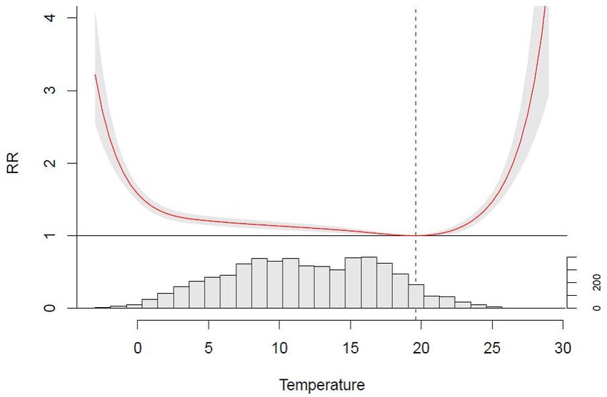
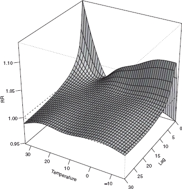
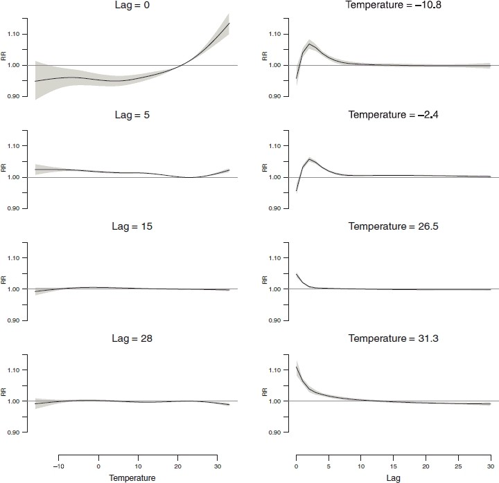
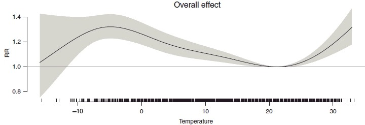
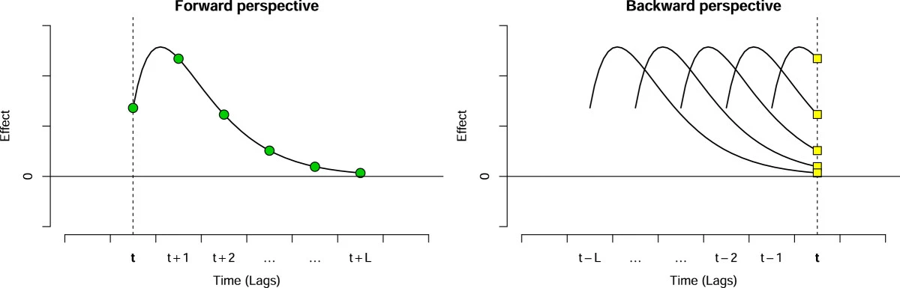

# Content

-   Introduction to DLNMs

-   Bayesian extension to DLNMs

- Main goals of my PhD thesis

# Introduction to DLNMs

## Background

-   Sometimes the effect of a specific exposure event is not limited to the period when it is observed, but it is delayed in time.

-   This is the case when studying the short-term effect of environmental stressors: high levels of air pollution or extreme temperatures affect health for a period lasting some days after its occurrence.

::: {.callout-note appearance="simple"}
## Objective

To model the relationship between an exposure occurrence and a sequence of future outcomes, specifying the distribution of the effects at different times (defined lags) after the event.
:::

## Distributed Lag Non-Linear Models

::: {.callout-note appearance="simple"}
## Definition

Family of models which can describe, in a flexible way, effects that vary simultaneously both along the space of the predictor and in the lag dimension of its occurrence.
:::

-   The assessed effect has two dimensions: the usual effect in the predictor space (called **exposure-response** relationship) and its temporal structure (called **lag-response** relationship).

-   Splines (natural cubic splines or B-splines) are commonly used for both dimensions to describe the non-linear effect as a smoothed curve along exposure values and lags.

## Distributed Lag Non-Linear Models

:::: {.columns}

::: {.column width="50%"}
Exposure-response curve
</img>
:::

::: {.column width="50%"}
Lag-response curve
</img>
:::

::::

## Distributed Lag Non-Linear Models (Formulae)

[@gasparrini]

-   Let $Y_t$ be a time series of daily counts of an outcome with $t = 1, ..., n$. Then:

$$
Y_t \sim \text{Poisson}(\mu_t) \\
log(\mu_t) = \alpha +  W\beta + \sum_{k = 1}^K\gamma_ku_{tk}
$$

-   $W$ is the crossbasis matrix representing a 2D functional surface transformation of the exposure values $x$, describing at the same time the dependency along the range of the predictor and in its lag dimension, usually through the definition of splines.

-   $u_k$ are other predictors with linear effects $\gamma_k$.

<!-- ## Crossbasis -->

<!-- - $s$ is the result of applying a set of smooth transformation of the exposure variable $x$ -->

<!-- builded in terms of a set of transformations of the original variable $x$ that generate a new set of variables, called basis variables.  -->

<!-- -   The non-linear relationship between $x$ and $log(\mu)$ is represented by $s(x)$, which is included in the predictor as sum of linear terms. -->

<!-- -   This linear model is obtained by a set of transformations of the original variable $x$ that generate a new set of variables, called basis variables. -->

<!-- -   First, we have to define the relationship in the space of the predictor (exposure-reponse): -->

<!-- $$ s(x_t;\beta) = z_t^T\beta $$ -->

<!-- → The basis matrix $Z$ ($n \times v_x$) is obtained by the application of the basis function (spline with $v_x$ df) to the original vector of exposures $x$. -->

<!-- ## Crossbasis -->

<!-- -   Then, we have to define the function to model the relationship in the lag dimension (lag-response), allowing for a delayed effect: -->

<!-- $$s(x_t;\eta) = q_t^TC\eta$$ -->

<!-- → $q_t = [x_t, ..., x_{t-L}]^T$ are the lagged exposures. -->

<!-- → the basis matrix $C$ ($(L+1) \times v_l$) is derived from the application of the basis function (spline with $v_l$ df) to the lag vector $[0,...,L]$. -->

<!-- ## Crossbasis -->

<!-- -   The final $s$ non-linear function modelled in the DLNM is obtained by apply concurrently this two previous transformations: -->

<!-- $$s(x_t; \eta) = \sum_{j=1}^{v_x}\sum_{k=1}^{v_l}r_{tj}^Tc_k\eta_{jk} = w_t^T\eta$$ -->

<!-- → $r_{tj}$ is the vector of lagged exposures for the time $t$ transformed through the exposure-response basis function. -->

<!-- → $W$ is the resulting cross-basis matrix ($n \times (v_x \cdot v_l)$) which is the product of applying the exposure-response and lag-response basis functions to $x$. -->

<!-- -   Conceptually, the crossbasis is a 2D functional surface describing at the same time the dependency along the range of the predictor and in its lag dimension, usually through the definition of splines. -->

## `dlnm` R package

-   The `dnlm` R package contains functions to specify and interpet DLNM models.

-   These functions are used to build basis and cross-basis matrices and to predict and plot the results of a fitted model.

-   Main functions:

    -   `crossbasis()`

    -   `crosspred()`

    -   `plot.crosspred()`

[@dlnm]

## Temperature effect on mortality: An application

-   We apply DLNMs to investigate the effect of temperature on overall mortality for the city of New York, during the period 1987–2000.

- Model specification was chosen based on literature: 

$$
Y_t \sim \text{QuasiPoisson}(\mu_t) \\
log(\mu_t) = \alpha + W \beta + \text{ns}(t; \text{7df}\cdot\text{year}) + \text{dow}_t + \gamma_1 \text{ozone}_{t,t-1}+ \gamma_2 \text{CO}_{t,t-1}
$$

- To build the $W$ crossbasis, a flexible model with natural cubic splines was used to describe the relationship in each dimension. The choice of the number of knots, which defines the df in each dimension, was based on modified AIC and BIC.

-   The maximum lag L was set to 30 days.

## Temperature effect on mortality: Results

- The result of a DLNM can be interpreted building a grid of predictions for each lag and for suitable
values of the predictor. There are many ways of plotting estimated relative risks:

1. They can be visualized as a 3-D surface in function of the exposure values and lags:

</img>

<figcaption>3-D plot of RR along temperature and lags, with reference at 21°C.</figcaption>

## Temperature effect on mortality: Results

2. Risks can be shown for a single predictor levels or lags, simply cutting a slice of the surface:

{width="800"}

## Temperature effect on mortality: Results

2. An estimate of the overall effect can be computed by summing all the contributions at different lags

{width="800"}

::: {.callout-note appearance="simple"}
## Note

The effects are usually reported versus a reference value of the predictor, centering the basis functions
for this space to their corresponding transformed values.
:::

## Minimum Mortality Temperature (MMT)

-   Specific temperature where mortality overall risk is lowest, representing the optimal point in the U/J-shaped temperature-mortality curve.

-   It is the value in which RR estimations are usually centered.

-   It can be generalized to the optimal effect exposure value in any given scenario.

## Attributable measures

-   Attributable fraction (AF) and number (AN) of outcome counts (e.g, deaths) that would have a population in a specific exposure scenario, compared to a reference one.

-   In general, if we have a given effect $\beta_x$ it can be defined as:

    $$
    \text{AF}_{x,t} = 1-exp(-\beta_x) \\
    \text{AN}_{x,t} = n \cdot \text{AF}_{x,t}
    $$

-   Usually effects $\beta_x$ are centered at the MMT before calculating attributable measures.

## Attributable measures

-   In the context of a DLNM model we don't have a single effect $\beta_x$:

[@attrdl]

# Bayesian extensions to DLNMs

## Bayesian Distributed Lag Non-Linear Models (B-DLNM)

-   Main benefits of Bayesian DLNMs:

    -   Posterior distributions can be used to derive the uncertainty of all DLNM estimators (e.g., MMT, attributable measures).

    -   DLNM models can be extended for accounting spatial and temporal random effects.

## The `bdlnm` R package

-   Replicate the `dlnm` R package to be able to fit `INLA` models instead of `glm` models.

-   Add a function to estimate minimum effect exposures (such as the MMT in the context of temperature and mortality).

-   Add a function to estimate attributable numbers and fractions.

-   Add the possibility to incorporate spatial and temporal random effects to the model.

## Spatial Bayesian Distributed Lag Non-Linear Models (SB-DLNM)

-   DLNMs are usually used in large-scale multi-location studies. The frequentist approach consists in performing a two-stage analysis:

    -   Independent models are individually fitted at each location, estimating the location-specific exposure-response relationship (first stage).

    -   Then, they are combined through multivariate meta-analysis to derive the average exposure-response relationship across locations (second stage).
    
- Main limitations:

    - Ignores spatial structure and any difference between risks at different locations.
    
    - Reduces the lag-response relationship in the first stage, selecting a specific lag or the overall effect.
    
    - Fitting independent models in small areas reduce the statistical power of the models, and models will struggle to give estimates in areas with few events.
    

## Spatial Bayesian Distributed Lag Non-Linear Models (SB-DLNM)

→ SB-DLNM provides a new framework for the estimation of reliable small-area lagged non-linear associations by accounting for spatial structured differences in the risk association across small areas [@SBDLNM].

## Temporal Bayesian Distributed Lag Non-Linear Models (TB-DLNM)

-   DLNMs usually combine data for a large period of time spanning different years.

-   The outcome temporal pattern is taken in account incorporating the seasonality, trend, week of the day, hollidays, etc. Nevertheless, the risks are estimated for the aggregated period without taking in account any temporal differences. 

- If we wanted to give the evolution over time of these risks, lines would be flat. We would have to fit an individual model for each single year (not enough data) or choose a model design fitting different moving average periods (as we will do in TEMOB).

→  TB-DLNM would provide a new framework for the estimation of temporal changing lagged non-linear associations by accounting for temporal structured differences in the risk association.

## Spatio-Temporal Bayesian Distributed Lag Non-Linear Models (STB-DLNM)

-   DLNMs are usually used in large-scale multi-location studies combining data for a large period of time spanning different years.

-   Risks for different years can be different spatially distributed, or risk for different areas can be different temporally distributed. Thus, spatio-temporal risk differences should be taken in account.

→ STB-DLNM would provide a new framework for the estimation of spatio-temporal changing lagged non-linear associations by accounting for spatio-temporal interaction structured differences in the risk association.

# Main goals of my PhD thesis

## Goals

The main goals of my PhD thesis on Bayesian distributed lag nonlinear models are:

1.  To develop of an R package for fitting B-DLNM: the `bdlnm` R package.

2.  To develop a new TB-DLNM framework.

3.  To develop a new STB-DLNM framework.

4.  To incorporate, SB-DLNM, TB-DLNM and STB-DLNM frameworks in the `bdlnm` R package.

5.  To incorporates STB-DLNM in the TEMOB shiny application.

A potential limitation to overcome is the overparameterization of this models. Interacting crossbasis with temporal, structural and spatio-temporal dependence will incorporate many parameters to the model: $v_x \cdot v_l \cdot v_\text{space} \cdot v_\text{time}$

## References
