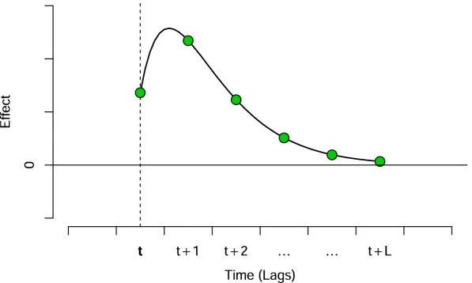

```{r setup, echo = FALSE, include = FALSE}
library(bdlnm)

# DLNMs and splines
library(dlnm)
library(splines)

# Data manipulation
library(dplyr)
library(reshape2)
library(stringr)
library(lubridate)

# Visualization
library(ggplot2)
library(gganimate)
library(ggnewscale)
library(patchwork)
library(scales)
library(plotly)

# Tables
library(gt)

# Execution time
library(tictoc)
```

# Background

## Motivation

- Climate change is intensifying exposure to extreme environmental conditions: heatwaves, air pollution, and cold spells (among others) are becoming more frequent and severe

- Environmental exposures rank among the strongest drivers of population health, often exerting a larger influence than genetic variation [@argentieri]

- Understanding how environmental exposures effects healths is therefore essential for public health research

## Distributed Lag Non-Linear Models (DLNMs)

- The relationship between environment and health is complex: effects are typically **non-linear** and **delayed**, making them hard to capture with standard regression approaches

- Environmental exposures rarely act instantaneously, their health impact unfolds over time:

  - A heatwave today may elevate mortality risk some days later

  - Air pollution accumulates biological damage across days or weeks

  - Cold temperatures can trigger cardiovascular events several days after exposure

::: {.callout-note appearance = "minimal"}
**Distributed Lag Non-Linear Models (DLNMs)** [@gasparrini] are the standard framework for capturing these dynamics. They simultaneously model two dimensions of risk:

1. How risk changes across exposure levels (**exposure-response**)
2. How risk evolves over time after exposure (**lag-response**)

DLNMs can be applied to any setting involving two time series and a delayed effect: environmental epidemiology, econometrics, pharmacology, and beyond
:::

## DLNMs

:::: {.columns}

::: {.column width="50%"}
1. **Exposure-response:** non-linear association between exposure value and health risk

<br>

```{r}
#| fig-width: 4
#| fig-height: 2.3
#| out-width: "100%"
#| echo: false
#| fig-align: "center"

x_ref <- 6.5

f <- function(x) {
  ifelse(x <= x_ref,
         0.06 * (x - x_ref)^2,
         0.55 * (x - x_ref)^2)
}

x_seq   <- seq(0, 10, length.out = 500)
y_curve <- f(x_seq)

par(mar = c(3.5, 3.5, 1, 1),
    mgp = c(2, 0.7, 0))       # c(axis.title, axis.labels, axis.line)

plot(x_seq, y_curve,
     type = "l", lwd = 2.5,
     xlab = "Exposure (x)", ylab = "Effect",
     xaxt = "n", yaxt = "n",
     xlim = c(0, 10),
     ylim = c(-0.5, max(y_curve) + 0.3),
     bty  = "l")

abline(h = 0,     lwd = 1.2)
abline(v = x_ref, lty = 2, lwd = 1.5)
axis(2, at = 0, labels = "0", cex.axis = 1.1)
axis(1, labels = FALSE, tick = FALSE)
```

:::

::: {.column width="50%"}
2. **Lag-response:** how the effect of a single exposure event evolves across subsequent lags


:::

::::

Usually, both dimensions are modelled simultaneously using **splines** (natural cubic or B-splines), producing a smooth bivariate surface over exposure and lag

## DLNMs: Model formulation

For time-series count data [@gasparrini]:

$$Y_t \sim \text{Poisson}(\mu_t)$$
$$\log(\mu_t) = \alpha + \underbrace{cb(x_t, \ldots, x_{t-L}) \cdot \beta}_{\text{cross-basis}} + \sum_{k} \gamma_k u_{kt}$$

| Term | Description |
|------|-------------|
| $cb(\cdot)$ | **Cross-basis**: tensor product of exposure and lag spline bases |
| $\beta$ | Coefficients of the cross-basis |
| $u_{kt}$ | (Time-varying) confounders (e.g. seasonality, trend)|
| $\gamma_k$ | Coefficients of the confounders |
| $\alpha$  | Intercept |

The cross-basis encodes the full bivariate exposure-lag-response surface in a single model term

## Limitations of classical DLNMs

- Datasets are becoming larger and more complex, with studies increasingly featuring granular spatial data across many locations

- Classical frequentist DLNMs rely on a **two-stage approach**:

  1. Independent DLNMs are fitted at each location separately (first stage)
  2. Location-specific estimates are pooled via multivariate meta-analysis (second stage)

::: {.callout-warning appearance = "minimal"}
**Key limitations**

- **Ignores spatial structure**: borrows no strength across neighbouring locations, discarding information about spatial variation in risk

- **Collapses the lag dimension**: first-stage models typically reduce to a single lag or cumulative effect, discarding the full lag-response surface

- **Unstable in sparse data**: independent models fitted in small areas with few events yield unreliable or unidentifiable estimates
:::

## Spatial Bayesian DLNMs (SB-DLNMs)

::: {.callout-note appearance = "minimal"}
A Bayesian extension, **Spatial Bayesian Distributed Lag Non-Linear Models (SB-DLNMs)** [@SBDLNM], was proposed to overcome these limitations, allowing reliable estimation of small-area lagged non-linear associations 
:::

- It accounts for spatially structured differences in risk across small areas

- Spatial random effects propagate information across locations, stabilising estimates in data-sparse areas

- The full bivariate exposure-lag-response surface is estimated in a **single stage**, preserving the lag dimension

# The {bdlnm} R package

## {bdlnm}

- The goal of the {bdlnm} R package is to provide a software for extending frequentist DLNMs to all kinds of Bayesian DLNMs (B-DLNMs)

- It's based on the package {dlnm}, which is the reference package used for DLNMs in a frequentist perspective [@dlnm]

<hr>

Published in CRAN since March 2026:

<center>
[](https://cran.r-project.org/package=bdlnm)&#160;&#160;
[](https://app.codecov.io/gh/pasahe/bdlnm?branch=main)&#160;&#160;
[](https://cran.r-project.org/package=bdlnm)&#160;&#160;
[](https://cran.r-project.org/package=bdlnm)
</center>

## Overview of the package

<br>

::: {.stretch-table}
| Purpose | Function | Based on |
|---|---|---|
| **Model fitting** | `bdlnm()` | New |
| **Prediction** | `bcrosspred()` | `dlnm::crosspred()` |
| **Attribution** | `attributable()` | `attrdl()` [@attrdl] |
| **Optimal exposure** | `optimal_exposure()` | New |
| **Visualisation** | `plot.bcrosspred()` | `dlnm::plot.crosspred()` |
| | `plot.optimal_exposure()` | New |

: {tbl-colwidths="[28, 36, 36]"}
:::

# Hands-on {bdlnm}: An application

## Temperature-mortality study

- We assess the immediate and delayed non-linear effect of daily mean temperature on mortality (age 75+) in London, 2000–2011

- We will use the {bdlnm} built-in `london` dataset: one observation per day, containing mortality counts, mean temperature, and calendar variables:

```{r echo = FALSE}
london |> 
    head() |> 
    gt::gt() |> 
    gt::cols_align("center") |>
    gt::tab_style(
      style = list(
        gt::cell_fill(color = "#1a7a6e"),
        gt::cell_text(color = "white", weight = "bold")
      ),
      locations = gt::cells_column_labels()
    ) |>
    gt::tab_style(
      style = gt::cell_fill(color = "#e8f4f2"),
      locations = gt::cells_body(rows = seq(1, nrow(head(london)), by = 2))
    ) |>
    gt::opt_table_font(font = "IBM Plex Sans") |>
    gt::tab_options(table.width = gt::pct(100))
```

[@london]

## Temperature and mortality time series

The two time series we aim to model:

```{r echo = FALSE, fig.align = "center"}
col_mort <- "#2f2f2f"
col_temp <- "#8e44ad"

# Scaling parameters
a <- (max(london$mort_75plus) - min(london$mort_75plus)) /
  (max(london$tmean) - min(london$tmean))
b <- min(london$mort_75plus) - min(london$tmean) * a

p <- ggplot(london, aes(x = yday(date))) +
  geom_line(
    aes(y = a * tmean + b, color = "Mean Temperature"),
    linewidth = 0.4
  ) +
  geom_line(
    aes(y = mort_75plus, color = "Daily Mortality (+75 years)"),
    linewidth = 0.4
  ) +
  facet_wrap(~year, ncol = 3) +
  scale_y_continuous(
    name = "Daily Mortality (+75 years)",
    breaks = seq(0, 225, by = 50),
    sec.axis = sec_axis(
      name = "Mean Temperature (°C)",
      transform = ~ (. - b) / a,
      breaks = seq(-10, 30, by = 10)
    )
  ) +
  scale_x_continuous(
    breaks = yday(as.Date(paste0(
      "2000-",
      c("01", "03", "05", "07", "09", "11"),
      "-01"
    ))),
    labels = c("Jan", "Mar", "May", "Jul", "Sep", "Nov"),
    expand = c(0.01, 0)
  ) +
  scale_color_manual(
    values = c(
      "Daily Mortality (+75 years)" = col_mort,
      "Mean Temperature" = col_temp
    )
  ) +
  labs(x = NULL, color = NULL) +
  guides(color = "none") +
  theme_minimal() +
  theme(
    axis.title.y.left = element_text(
      color = col_mort,
      face = "bold",
      margin = margin(r = 8)
    ),
    axis.title.y.right = element_text(
      color = col_temp,
      face = "bold",
      margin = margin(l = 8)
    ),
    axis.text.y.left = element_text(color = col_mort),
    axis.text.y.right = element_text(color = col_temp)
  ) +
  transition_reveal(as.numeric(date))

animate(p, nframes = 300, fps = 10, end_pause = 100)
```

## Model specification

$$Y_t \sim \text{Poisson}(\mu_t), \qquad \log(\mu_t) = \alpha + cb(x_t, \ldots, x_{t-L}) \cdot \beta + \sum_{k} \gamma_k u_{kt}$$

Following standard choices in temperature-mortality literature [@gasparrini]:

:::: {.columns}

::: {.column width="50%"}
**Cross-basis** ($cb$)

- Exposure-response: natural spline, knots at the **10th**, **75th**, and **90th** percentiles of temperature

- Lag-response: natural spline, **3** knots equally spaced on the log scale, max lag of **21 days**
:::

::: {.column width="50%"}
**Confounders** ($u_{kt}$)

- Seasonality and long-term trend: natural spline with **8 df/year**

- Day of the week: factor variable
:::

::::

## Building the cross-basis

Using the `dlnm` package to construct the cross-basis matrix `cb`:

```{r echo = TRUE}
# Exposure-response and lag-response spline parameters
dlnm_var <- list(
  var_prc = c(10, 75, 90),
  var_fun = "ns",
  lag_fun = "ns",
  max_lag = 21,
  lagnk = 3
)

# Build cross-basis 
argvar <- list(
  fun = dlnm_var$var_fun,
  knots = quantile(london$tmean, dlnm_var$var_prc / 100, na.rm = TRUE),
  Bound = range(london$tmean, na.rm = TRUE)
)
arglag <- list(
  fun = dlnm_var$lag_fun,
  knots = logknots(dlnm_var$max_lag, nk = dlnm_var$lagnk)
)

cb <- crossbasis(london$tmean, lag = dlnm_var$max_lag, argvar, arglag)
```

## Building the cross-basis

Seasonality term and temperature prediction grid:

```{r echo = TRUE}
seas <- ns(london$date, df = round(8 * length(london$date) / 365.25))
```

Finally, we have to define the temperature grid in which predictions will be made:

```{r echo = TRUE}
temp <- round(seq(min(london$tmean), max(london$tmean), by = 0.1), 1)
```

## Fitting the Bayesian DLNM

```{r echo = TRUE}
mod <- bdlnm(
  mort_75plus ~ cb + factor(dow) + seas,
  data = london,
  family = "poisson",
  sample.arg = list(n = 1000, seed = 5243)
)
```

`bdlnm()` handles two things internally:

  1. Fits the model using *R-INLA*
  2. Returns posterior samples and summaries for all parameters

```{r}
 str(mod, max.level = 1)
```

## Fitting the Bayesian DLNM

Now we have a matrix with the estimated posterior samples of the model coefficients, together with their summary across samples:

**Posterior samples** `mod$coefficients` 

```{r}
mod$coefficients[1:5, 1:5]
```

**Posterior summary** `mod$coefficients.summary` 

```{r}
mod$coefficients.summary[1:5, -6]
```

<span style="font-size:0.8em;"><em>* Visualizing only the first 5 coefficients and the first 5 posterior samples</em></span>

## Minimum mortality temperature (MMT)

::: {.callout-note appearance="minimal"}
The **minimum mortality temperature (MMT)** is the temperature at which the overall cumulative mortality risk is minimised. It is used as the reference value to center relative risk estimates, so that all effects are interpreted relative to the temperature associated with lowest mortality
:::

```{r echo = TRUE}
mmt <- optimal_exposure(mod, exp_at = temp)
```

```{r}
str(mmt, max.level = 1)
```

## MMT posterior distribution

```{r echo = FALSE, fig.align = "center"}
ggplot(as.data.frame(mmt$est), aes(x = mmt$est)) +
  geom_histogram(
    fill = "#A8C5DA",
    bins = length(unique(mmt$est)),
    alpha = 0.6,
    color = "white"
  ) +
  geom_density(
    aes(y = after_stat(density) * length(mmt$est) / length(unique(mmt$est))),
    color = "#2E5E7E",
    linewidth = 1.2,
    adjust = 2 # <-- key change: higher = smoother
  ) +
  geom_vline(
    xintercept = mmt$summary["0.5quant"],
    color = "#2E5E7E",
    linewidth = 1.1,
    linetype = "dashed"
  ) +
  scale_x_continuous(breaks = seq(min(mmt$est), max(mmt$est), by = 0.1)) +
  labs(x = "Temperature (°C)", y = "Frequency") +
  theme_minimal()
```

::: {.callout-note appearance="minimal"}
The posterior is concentrated around 18.9°C and unimodal: the median is a stable centering value for the relative risk estimates
:::

## MMT posterior distribution

The built-in `plot.optimal_exposure()` provides a quick visualisation of the MMT posterior distribution directly from the `mmt` object:

```{r echo = TRUE, fig.align = "center"}
plot(mmt)
```

## Predicting exposure-lag-response effects

From the fitted model, `bcrosspred()` computes the full bivariate exposure-lag-response association. Relative risks must be centered at the MMT:

```{r echo = TRUE}
cen <- mmt$summary[["0.5quant"]]
cpred <- bcrosspred(mod, exp_at = temp, cen = cen)
```

```{r echo = FALSE}
str(cpred[c(1, 2, 3, 4, 7, 8, 9, 12, 13)], max.level = 1)
```

## Predicting exposure-lag-response effects

Now we have an array of estimated posterior RRs for each temperature–lag combination, together with their summary across samples:

:::: {.columns}

::: {.column width="50%"}
**Posterior samples** `matRRfit`

```{r}
cpred$matRRfit[1:4, 1:4, 1:1, drop = FALSE]
```

<span style="font-size:0.8em;"><em> *Visualizing only first 4 temperatures and lags and 1 sample </em></span>

:::

::: {.column width="50%"}
**Posterior summary** `matRRfit.summary` 

```{r}
cpred$matRRfit.summary[1:4, 1:4, 1, drop = FALSE]
```

<span style="font-size:0.8em;"><em> *Visualizing only first 4 temperatures and lags and 1 summary statistic </em></span>

:::

::::

## Exposure-lag-response surface

The full bivariate association can be represented as a 3-D surface over temperature and lag, giving the RR at each specific temperature-lag combination:

```{r out.width = "100%"}
matRRfit_median <- cpred$matRRfit.summary[,, "0.5quant"]
x <- rownames(matRRfit_median)
y <- colnames(matRRfit_median)
z <- t(matRRfit_median)

zmin <- min(z, na.rm = TRUE)
zmax <- max(z, na.rm = TRUE)
mid <- (1 - zmin) / (zmax - zmin)

plot_ly(width = 850, height = 520) |>
  add_surface(
    x = x,
    y = y,
    z = z,
    surfacecolor = z,
    cmin = zmin,
    cmax = zmax,
    colorscale = list(
      c(0, "#00696e"),
      c(mid * 0.5, "#80c8c8"),
      c(mid, "#f5f0e8"),
      c(mid + (1 - mid) * 0.5, "#c2714f"),
      c(1, "#6b1c1c")
    ),
    colorbar = list(title = "RR")
  ) |>
  add_surface(
    x = x,
    y = y,
    z = matrix(1, nrow = length(y), ncol = length(x)),
    colorscale = list(c(0, "black"), c(1, "black")),
    opacity = 0.4,
    showscale = FALSE
  ) |>
  layout(
    scene = list(
      xaxis = list(title = "Temperature (°C)"),
      yaxis = list(title = "Lag", tickvals = y, ticktext = gsub("lag", "", y)),
      zaxis = list(title = "RR"),
      camera = list(eye = list(x = 1.5, y = -1.8, z = 0.8))
    )
  )
```

## Exposure-lag-response surface

The built-in `plot.bcrosspred()` function provides a quick visualization of the same surface directly from the `cpred` object:

```{r echo = TRUE, fig.align = "center"}
plot(cpred, ptype = "3d")
```

## Lag-response associations

Slicing the surface at each temperature value gives one lag-response curve per each exposure level:

```{r echo = FALSE, fig.align = "center"}
matRRfit <- cbind(
  melt(cpred$matRRfit.summary[,, "0.5quant"], value.name = "RR"),
  RR_lci = melt(
    cpred$matRRfit.summary[,, "0.025quant"],
    value.name = "RR_lci"
  )$RR_lci,
  RR_uci = melt(
    cpred$matRRfit.summary[,, "0.975quant"],
    value.name = "RR_uci"
  )$RR_uci
) |>
  rename(temperature = Var1, lag = Var2) |>
  mutate(
    lag = as.numeric(gsub("lag", "", lag))
  )

temps <- cpred$exp_at

p <- ggplot() +
  # Lag-responses curves colored by temperature
  geom_line(
    data = matRRfit,
    aes(x = lag, y = RR, group = temperature, color = temperature),
    alpha = 0.35,
    linewidth = 0.35
  ) +
  scale_color_gradientn(
    colours = c(
      "#2166ac",
      "#4393c3",
      "#92c5de",
      "#d1e5f0",
      "#f7f7f7",
      "#fddbc7",
      "#f4a582",
      "#d6604d",
      "#b2182b"
    ),
    name = "Temperature"
  ) +
  # Start a new color scale for highlighted curves
  ggnewscale::new_scale_color() +
  # RR = 1 reference
  geom_hline(
    yintercept = 1,
    linetype = "dashed",
    color = "grey30",
    linewidth = 0.5
  ) +
  scale_x_continuous(breaks = cpred$lag_at) +
  scale_y_continuous(trans = "log10", breaks = pretty_breaks(6)) +
  labs(
    x = "Lag (days)",
    y = "Relative Risk (RR)"
  ) +
  theme_minimal() +
  theme(legend.position = "top", panel.grid.minor.x = element_blank()) + 
  transition_states(
    temperature,
    transition_length = 1,
    state_length = 0
  ) +
  shadow_mark(past = TRUE, future = FALSE, alpha = 0.6)

animate(p, nframes = 300, fps = 15, end_pause = 100)
```

## Lag-response associations

`plot.bcrosspred()` can slice at a specific temperature directly from the `cpred` object. For example, here the 99th percentile (extreme heat):

```{r echo = TRUE, fig.align = "center"}
plot(cpred, ptype = "slices", exp_at = round(quantile(london$tmean, 0.99), 1), log = "y")
```

## Exposure-response associations

Slicing at each lag value gives one exposure-response curve per lag:

```{r echo = FALSE, fig.width = 12, fig.height = 8, fig.align="center"}
RRfit <- rbind(matRRfit)

# Split data
RRfit_lags <- RRfit |>
  filter(!lag %in% c("overall")) |>
  mutate(lag = as.numeric(lag))

temps <- cpred$exp_at
t_cold <- temps[which.min(abs(temps - quantile(temps, 0.01)))]
t_hot <- temps[which.min(abs(temps - quantile(temps, 0.99)))]

# Top plot: exposure-response curves for each lag and overall
p_main <- ggplot() +
  # Background: all lags, fading from vivid (small) to pale (large)
  geom_line(
    data = RRfit_lags,
    aes(x = temperature, y = RR, group = lag, color = lag),
    linewidth = 0.8
  ) +
  scale_color_gradientn(
    colours = c(
      "black",
      "#2b1d2f",
      "#4a2f5e",
      "#6a4c93",
      "#8b6bb8",
      "#b39cdb",
      "#d8c9f1",
      "#f3eef5"
    ),
    values = scales::rescale(c(0, 0.5, 1, 2, 3, 4, 5, 10, 20))
  ) +
  geom_hline(
    yintercept = 1,
    linetype = "dashed"
  ) +
  scale_y_continuous(
    transform = "log10",
    breaks = sort(c(0.8, pretty_breaks(5)(c(0.8, 4))))
  ) +
  labs(
    x = NULL,
    y = "Relative Risk (RR)",
    color = NULL,
    fill = NULL
  ) +
  theme_minimal() +
  theme(
    legend.position = "top",
    axis.text.x = element_blank(),
    plot.margin = margin(8, 8, 0, 8)
  )

# Bottom plot: histogram with percentile lines
p_hist <- ggplot(london, aes(x = tmean)) +
  geom_histogram(
    aes(y = after_stat(density), fill = after_stat(x)),
    binwidth = 0.5,
    color = "black",
    linewidth = 0.2
  ) +
  geom_vline(
    xintercept = t_cold,
    linetype = "dashed",
    color = "#053061",
    linewidth = 0.6
  ) +
  geom_vline(
    xintercept = t_hot,
    linetype = "dashed",
    color = "#67001f",
    linewidth = 0.6
  ) +
  geom_vline(
    xintercept = cen,
    linetype = "dashed",
    color = "grey20",
    linewidth = 0.6
  ) +
  annotate(
    "text",
    x = t_cold,
    y = Inf,
    label = "1st pct",
    vjust = 1.4,
    hjust = 1.1,
    size = 3.2,
    color = "#053061"
  ) +
  annotate(
    "text",
    x = t_hot,
    y = Inf,
    label = "99th pct",
    vjust = 1.4,
    hjust = -0.1,
    size = 3.2,
    color = "#67001f"
  ) +
  annotate(
    "text",
    x = cen,
    y = Inf,
    label = "MMT",
    vjust = 1.4,
    hjust = -0.1,
    size = 3.2,
    color = "grey20"
  ) +
  scale_x_continuous(limits = range(cpred$exp_at)) +
  scale_fill_gradientn(
    colours = c(
      "#053061",
      "#2166ac",
      "#4393c3",
      "#92c5de",
      "#d1e5f0",
      "#f7f7f7",
      "#fddbc7",
      "#f4a582",
      "#d6604d",
      "#b2182b",
      "#67001f"
    ),
    name = "Temperature"
  ) +
  labs(x = "Temperature (°C)", y = "Density") +
  theme_minimal() +
  theme(
    plot.margin = margin(20, 8, 8, 8),
    legend.position = "bottom"
  )

# Combine them:
p_main / p_hist + plot_layout(heights = c(3, 1))
```

## Exposure-response associations

`plot.bcrosspred()` can also slice at a specific lag directly from the `cpred` object. For example, here lag 0 (the immediate effect only):

```{r echo = TRUE, fig.align = "center"}
plot(cpred, ptype = "slices", lag_at = 0, log = "y")
```

## Overall cumulative effect

Summing all lag contributions gives the **overall cumulative exposure-response curve** which is the most commonly reported summary in temperature-mortality studies:

$$RR_{x,\,\text{overall}} = \exp\!\Bigl(\sum_{l=0}^{L} \beta_{x,l}\Bigr)$$

::: {.callout-note appearance="minimal"}
This collapses the 3-D surface into a single curve, showing how the total accumulated risk summing up all the lags varies with temperature
:::

## Overall cumulative effect

```{r, fig.width = 12, fig.height = 8, fig.align="center"}
allRRfit <- data.frame(
  temperature = as.numeric(rownames(cpred$allRRfit.summary)),
  lag = "overall",
  RR = cpred$allRRfit.summary[, "0.5quant"],
  RR_lci = cpred$allRRfit.summary[, "0.025quant"],
  RR_uci = cpred$allRRfit.summary[, "0.975quant"]
)

RRfit <- rbind(matRRfit, allRRfit)

# Split data
RRfit_lags <- RRfit |>
  filter(!lag %in% c("overall")) |>
  mutate(lag = as.numeric(lag))
RRfit_overall <- RRfit |>
  filter(lag %in% c("overall"))

temps <- cpred$exp_at
t_cold <- temps[which.min(abs(temps - quantile(temps, 0.01)))]
t_hot <- temps[which.min(abs(temps - quantile(temps, 0.99)))]

# Top plot: exposure-response curves for each lag and overall
p_main <- ggplot() +
  # Background: all lags, fading from vivid (small) to pale (large)
  geom_line(
    data = RRfit_lags,
    aes(x = temperature, y = RR, group = lag, color = lag),
    linewidth = 0.8
  ) +
  scale_color_gradientn(
    colours = c(
      "black",
      "#2b1d2f",
      "#4a2f5e",
      "#6a4c93",
      "#8b6bb8",
      "#b39cdb",
      "#d8c9f1",
      "#f3eef5"
    ),
    values = scales::rescale(c(0, 0.5, 1, 2, 3, 4, 5, 10, 20))
  ) +
  new_scale_color() +
  new_scale_fill() +
  # Credible intervals
  geom_ribbon(
    data = RRfit_overall,
    aes(
      x = temperature,
      ymin = RR_lci,
      ymax = RR_uci,
      fill = "1"
    ),
    alpha = 0.2
  ) +
  # Highlighted curves
  geom_line(
    data = RRfit_overall,
    aes(x = temperature, y = RR, color = "1"),
    linewidth = 1.2
  ) +
  geom_hline(
    yintercept = 1,
    linetype = "dashed"
  ) +
  scale_color_manual(values = "#a6761d", labels = "Overall (CrI95%)") +
  scale_fill_manual(values = "#a6761d", labels = "Overall (CrI95%)") +
  scale_y_continuous(
    transform = "log10",
    breaks = sort(c(0.8, pretty_breaks(5)(c(0.8, 4))))
  ) +
  labs(
    x = NULL,
    y = "Relative Risk (RR)",
    color = NULL,
    fill = NULL
  ) +
  theme_minimal() +
  theme(
    legend.position = "top",
    axis.text.x = element_blank(),
    plot.margin = margin(8, 8, 0, 8)
  )

# Bottom plot: histogram with percentile lines
p_hist <- ggplot(london, aes(x = tmean)) +
  geom_histogram(
    aes(y = after_stat(density), fill = after_stat(x)),
    binwidth = 0.5,
    color = "black",
    linewidth = 0.2
  ) +
  geom_vline(
    xintercept = t_cold,
    linetype = "dashed",
    color = "#053061",
    linewidth = 0.6
  ) +
  geom_vline(
    xintercept = t_hot,
    linetype = "dashed",
    color = "#67001f",
    linewidth = 0.6
  ) +
  geom_vline(
    xintercept = cen,
    linetype = "dashed",
    color = "grey20",
    linewidth = 0.6
  ) +
  annotate(
    "text",
    x = t_cold,
    y = Inf,
    label = "1st pct",
    vjust = 1.4,
    hjust = 1.1,
    size = 3.2,
    color = "#053061"
  ) +
  annotate(
    "text",
    x = t_hot,
    y = Inf,
    label = "99th pct",
    vjust = 1.4,
    hjust = -0.1,
    size = 3.2,
    color = "#67001f"
  ) +
  annotate(
    "text",
    x = cen,
    y = Inf,
    label = "MMT",
    vjust = 1.4,
    hjust = -0.1,
    size = 3.2,
    color = "grey20"
  ) +
  scale_x_continuous(limits = range(cpred$exp_at)) +
  scale_fill_gradientn(
    colours = c(
      "#053061",
      "#2166ac",
      "#4393c3",
      "#92c5de",
      "#d1e5f0",
      "#f7f7f7",
      "#fddbc7",
      "#f4a582",
      "#d6604d",
      "#b2182b",
      "#67001f"
    ),
    name = "Temperature"
  ) +
  labs(x = "Temperature (°C)", y = "Density") +
  theme_minimal() +
  theme(
    plot.margin = margin(20, 8, 8, 8),
    legend.position = "bottom"
  )

# Combine them:
p_main / p_hist + plot_layout(heights = c(3, 1))
```

## Overall cumulative effect

`plot.bcrosspred()` produces the overall curve directly from the `cpred` object:

```{r echo = TRUE, fig.align = "center"}
plot(cpred, ptype = "overall", log = "y")
```

## Attributable burden

- The `attributable()` function estimates the mortality burden **attributable to non-optimal temperature exposures**:

  - **Attributable fraction (AF):** proportion of all mortality events attributable to temperature
  - **Attributable number (AN):** absolute number of deaths attributable to temperature

::: {.callout-note appearance = "minimal"}
The idea is to compare observed mortality under real temperature conditions against a counterfactual scenario where the population was always exposed to an optimal reference temperature (e.g. the MMT) over the same period
:::

## Attributable burden

For a given centered effect $\beta_x$, the measures are defined as:

$$\text{AF}_{x,t} = 1 - \exp(-\beta_x) \qquad \text{AN}_{x,t} = n \cdot \text{AF}_{x,t}$$

::: {.callout-warning appearance="minimal"}
Effects $\beta_x$ must be centered at a reference exposure (e.g. MMT) before computing attributable measures. Uncentered effects produce uninterpretable results
:::

## Attributable burden in a DLNM

- In a DLNM there is no single $\beta_x$ as the effect is distributed across lags

- The `attributable()` function handles this through two perspectives [@attrdl]:

[](https://bmcmedresmethodol.biomedcentral.com/articles/10.1186/1471-2288-14-55)

## Computing attributable burden

`attributable()` returns daily and aggregated AF and AN using either the forward or backward perspective:

```{r echo = TRUE}
attr <- attributable(mod, london, name_date = "date", name_exposure = "tmean", name_cases = "mort_75plus", cen = cen, dir = "forw")
```

```{r}
str(attr, max.level = 1)
```

## Daily attributable fraction

Time series of daily attributable fractions (AFs), together with the temperature exposition in that given day:

```{r echo = FALSE, fig.align = "center"}
col_af <- "black"

temp_colours <- c(
  "#053061",
  "#2166ac",
  "#4393c3",
  "#92c5de",
  "#d1e5f0",
  "#f7f7f7",
  "#fddbc7",
  "#f4a582",
  "#d6604d",
  "#b2182b",
  "#67001f"
)

af_med <- attr$af.summary[, "0.5quant"]

# Pre-compute range once
af_min <- min(af_med, na.rm = TRUE) - 0.01
af_max <- max(af_med, na.rm = TRUE) + 0.01

df <- data.frame(
  date = london$date,
  x = yday(london$date),
  year = year(london$date),
  tmean = london$tmean,
  af = af_med
)

ggplot(df, aes(x = x)) +
  # Full-height temperature background per day
  geom_rect(
    aes(
      xmin = x - 0.5,
      xmax = x + 0.5,
      ymin = af_min,
      ymax = af_max,
      fill = tmean
    )
  ) +
  scale_fill_gradientn(
    colours = temp_colours,
    name = "Temperature (°C)"
  ) +
  # AF line on top
  geom_line(
    aes(y = af),
    color = col_af,
    linewidth = 0.7
  ) +
  scale_y_continuous(
    name = "Attributable Fraction (AF)",
    breaks = seq(0, 1, by = 0.1),
    limits = c(af_min, af_max),
    expand = c(0, 0)
  ) +
  scale_x_continuous(
    breaks = yday(as.Date(paste0(
      "2000-",
      c("01", "03", "05", "07", "09", "11"),
      "-01"
    ))),
    labels = c("Jan", "Mar", "May", "Jul", "Sep", "Nov"),
    expand = c(0, 0)
  ) +
  facet_wrap(~year, ncol = 3, axes = "all_x") +
  labs(x = NULL) +
  theme_minimal(base_size = 11) +
  theme(
    panel.spacing.x = unit(0, "pt"),
    strip.text = element_text(face = "bold", size = 10),
    legend.position = "top",
    legend.key.width = unit(2.5, "cm")
  )
```

## Total attributable burden

Total mortality burden attributable to non-optimal temperatures in the London 75+ population across 2000–2011:

```{r}
rbind(
  "Attributable fraction" = attr$aftotal.summary,
  "Attributable number" = attr$antotal.summary
) |>
  as.data.frame() |>
  round(3) |>
  gt(rownames_to_stub = TRUE) |>
  gt::tab_style(
    style = list(
      gt::cell_fill(color = "#1a7a6e"),
      gt::cell_text(color = "white", weight = "bold")
    ),
    locations = gt::cells_column_labels()
  ) |>
  gt::tab_style(
    style = list(
      gt::cell_fill(color = "#1a7a6e"),
      gt::cell_text(color = "white", weight = "bold")
    ),
    locations = gt::cells_stub()
  ) |>
  gt::opt_table_font(font = "IBM Plex Sans") |>
  gt::tab_options(table.width = gt::pct(100))
```

# Conclusions

## Conclusions

- The {bdlnm} package provides a powerful and accessible implementation of Bayesian Distributed Lag Non-Linear Models in R, built on top of the widely used {dlnm} framework

- Combining the flexibility of DLNMs with full Bayesian inference enables researchers to fit more realistic and complex models while fully propagating uncertainty

- The posterior distribution of all estimates allows direct uncertainty quantification of derived measures (e.g., MMT, attributable fractions, attributable numbers) without additional approximations

- It provides a complete DLNM workflow in just a few steps: model fitting, prediction, and attribution

- The framework extends beyond environmental epidemiology to any setting with time-varying exposures and delayed effects making it a general tool for time series analysis

## Present and future work

**Currently in development**

- `mcmc_to_bdlnm()`: convert any object with posterior samples of DLNM coefficients from an MCMC algorithm (e.g. NIMBLE, Stan) into a `bdlnm` object, enabling broader model compatibility beyond INLA

**Coming soon**

- **Multi-location analysis:** pool independent exposure-lag-response curves across cities or regions within a single model

- **Spatial B-DLNMs (SB-DLNM):** explicitly model spatial heterogeneity in exposure-lag-response associations across regions

- **Parallelization:** faster inference via {futurize} for large datasets

::: {.callout-note appearance="minimal"}
Contributions and feature requests are welcome via the GitHub repository at **github.com/pasahe/bdlnm**
:::

## Further resources

```{=html}
<div style="display: grid; grid-template-rows: auto auto; gap: 1.2rem; padding: 0.5rem 0;">

  <!-- Row 1: two cards side by side -->
  <div style="display: grid; grid-template-columns: 1fr 1fr; gap: 1rem;">

    <a href="https://pasahe.github.io/bdlnm/" target="_blank"
       style="text-decoration: none; border: 0.5px solid #ccc; border-radius: 10px; overflow: hidden; display: flex; flex-direction: column; color: inherit;">
      
      <div style="padding: 0.6rem 0.8rem; font-size: 0.8em; line-height: 1.4;">
        📦 Full documented vignettes available on the package webpage<br>
        <span style="font-size: 0.85em; color: #0077cc;">https://pasahe.github.io/bdlnm/</span>
      </div>
    </a>

    <a href="https://www.r-bloggers.com/2026/04/new-r-package-bdlnm-released-on-cran-bayesian-distributed-lag-non-linear-models-in-r-via-inla/"
       target="_blank"
       style="text-decoration: none; border: 0.5px solid #ccc; border-radius: 10px; overflow: hidden; display: flex; flex-direction: column; color: inherit;">
      
      <div style="padding: 0.6rem 0.8rem; font-size: 0.8em; line-height: 1.4;">
        📊 Learn to build fancy plots combining <code>bdlnm</code> with <code>ggplot2</code> and <code>plotly</code><br>
        <span style="font-size: 0.75em; color: #0077cc; word-break: break-all;">https://www.r-bloggers.com/2026/04/new-r-package-bdlnm-released-on-cran-bayesian-distributed-lag-non-linear-models-in-r-via-inla/</span>
      </div>
    </a>

  </div>

  <!-- Row 2: GitHub card centred -->
  <div style="display: flex; justify-content: center;">
    <a href="https://github.com/pasahe/bdlnm" target="_blank"
       style="text-decoration: none; border: 0.5px solid #ccc; border-radius: 10px; overflow: hidden; display: flex; flex-direction: column; color: inherit; width: 50%;">
      
      <div style="padding: 0.6rem 0.8rem; font-size: 0.8em; line-height: 1.4;">
        🐛 Bug reports and contributions welcome via the GitHub repository<br>
        <span style="font-size: 0.85em; color: #0077cc;">https://github.com/pasahe/bdlnm</span>
      </div>
    </a>
  </div>

</div>
```

## References
