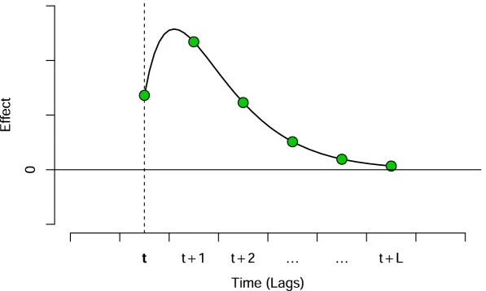
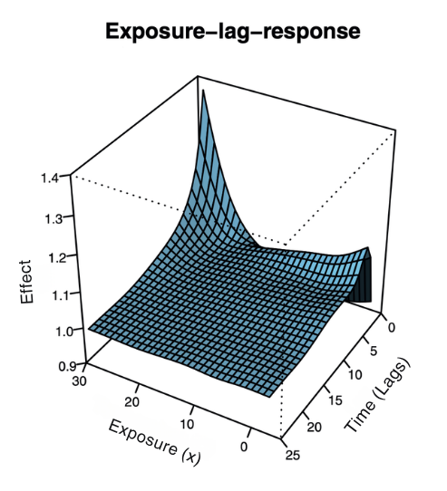
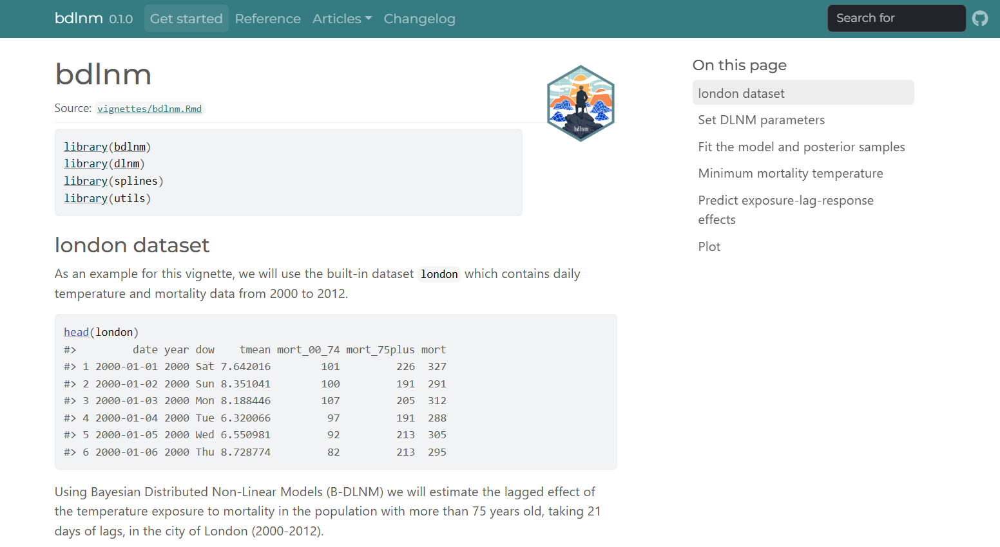

```{r setup, echo = FALSE, include = FALSE}
library(bdlnm)

# DLNMs and splines
library(dlnm)
library(splines)

# Data manipulation
library(dplyr)
library(reshape2)
library(stringr)
library(lubridate)

# Visualization
library(ggplot2)
library(gganimate)
library(ggnewscale)
library(patchwork)
library(scales)
library(plotly)

# Tables
library(gt)

# Execution time
library(tictoc)
```

# Background

## Motivation

- Climate change is intensifying extreme environmental conditions: heatwaves, cold spells are becoming more frequent and severe

- Environmental exposures rarely act instantaneously, as their health impact unfolds over time:

  - A heatwave today may elevate mortality risk several days later

  - Cold temperatures can trigger cardiovascular events long after exposure

  - Air pollution accumulates biological damage across days or weeks

- Standard regression approaches struggle to capture these **delayed** and usually **non-linear** effects simultaneously

## Distributed Lag Non-Linear Models (DLNMs)

DLNMs [@gasparrini] are the standard framework for capturing these dynamics, simultaneously modelling two dimensions of risk:

:::: {.columns}

::: {.column width="42.5%"}
1. **Exposure-response:** how risk changes across exposure levels

```{r}
#| fig-width: 4
#| fig-height: 2.1
#| out-width: "100%"
#| echo: false
#| fig-align: "center"

x_ref <- 6.5

f <- function(x) {
  ifelse(x <= x_ref,
         0.06 * (x - x_ref)^2,
         0.55 * (x - x_ref)^2)
}

x_seq   <- seq(0, 10, length.out = 500)
y_curve <- f(x_seq)

par(mar = c(3.5, 3.5, 1, 1),
    mgp = c(2, 0.7, 0))       # c(axis.title, axis.labels, axis.line)

plot(x_seq, y_curve,
     type = "l", lwd = 2.5,
     xlab = "Exposure (x)", ylab = "Effect",
     xaxt = "n", yaxt = "n",
     xlim = c(0, 10),
     ylim = c(-0.5, max(y_curve) + 0.3),
     bty  = "l")

abline(h = 0,     lwd = 1.2)
axis(2, at = 0, labels = "0", cex.axis = 1.1)
axis(1, labels = FALSE, tick = FALSE)
```

:::

::: {.column width="5%"}
:::

::: {.column width="5%"}
:::

::: {.column width="5%"}
:::

::: {.column width="42.5%"}
2. **Lag-response:** how risk evolves over time after exposure (lags)


:::

::::

- Usually splines (natural cubic, B-splines or P-splines) are used to define these usually non-linear relationships in each dimension.

## Distributed Lag Non-Linear Models (DLNMs)

- The tensor product of the two spline bases defines the **cross-basis**: a smooth bivariate surface over exposure and lag

:::: {.columns}

::: {.column width="32%"}
1. **Exposure-response**

```{r}
#| fig-width: 4
#| fig-height: 2.1
#| out-width: "100%"
#| echo: false
#| fig-align: "center"

x_ref <- 6.5

f <- function(x) {
  ifelse(x <= x_ref,
         0.06 * (x - x_ref)^2,
         0.55 * (x - x_ref)^2)
}

x_seq   <- seq(0, 10, length.out = 500)
y_curve <- f(x_seq)

par(mar = c(3.5, 3.5, 1, 1),
    mgp = c(2, 0.7, 0))       # c(axis.title, axis.labels, axis.line)

plot(x_seq, y_curve,
     type = "l", lwd = 2.5,
     xlab = "Exposure (x)", ylab = "Effect",
     xaxt = "n", yaxt = "n",
     xlim = c(0, 10),
     ylim = c(-0.5, max(y_curve) + 0.3),
     bty  = "l")

abline(h = 0,     lwd = 1.2)
axis(2, at = 0, labels = "0", cex.axis = 1.1)
axis(1, labels = FALSE, tick = FALSE)
```
:::

::: {.column width="3%"}
<div style="text-align:center; font-size:1.5em; margin-top:100px;">
$\times$
</div>
:::

::: {.column width="32%"}
2. **Lag-response**


:::

::: {.column width="3%"}
<div style="text-align:center; font-size:1.5em; margin-top:100px;">
$=$
</div>
:::

::: {.column width="30%"}
<div style="text-align:center;">
  
</div>
:::

::::

## DLNMs: Model formulation

$$\log(E(Y_t)) = \alpha + \underbrace{cb(x_t, \ldots, x_{t-L}) \cdot \boldsymbol{\beta}}_{\text{cross-basis}} + \sum_{k} \gamma_k u_{kt}$$

| Term | Description |
|------|-------------|
| $cb(\cdot)$ | **Cross-basis**: tensor product of exposure and lag spline bases |
| $\boldsymbol{\beta}$ | Coefficients of the cross-basis |
| $u_{kt}$ | (Time-varying) confounders (e.g. seasonality, trend)|
| $\gamma_k$ | Coefficients of the confounders |
| $\alpha$  | Intercept |

## Bayesian DLNMs

Same model, with **prior distributions** placed on all parameters:

$$\log(E(Y_t)) = \alpha + \underbrace{cb(x_t, \ldots, x_{t-L}) \cdot \boldsymbol{\beta}}_{\text{cross-basis}} + \sum_{k} \gamma_k u_{kt}$$

$$\alpha, \boldsymbol{\beta}, \gamma_k \sim \text{(prior distributions)}$$

Every parameter now has its **posterior distribution** 

This enables:

- **Full uncertainty quantification** of all estimates via posterior distributions

- **Uncertainty propagation** in derived measures (optimal exposure, attributable burden) without additional approximations

- **Hierarchical extensions** to add layers of complexity in the model (e.g. Spatial Bayesian DLNMs, @SBDLNM)

# The {bdlnm} R package

## {bdlnm}

:::: {.columns style="display:flex; flex-wrap:nowrap;"}

::: {.column width="30%"}
{fig-align="center"}
:::

::: {.column width="5%"}

<hr style="width:2px; height:370px; background-color:#6C878F; border:none; margin-top: 30% !important; margin:0 auto; " />

:::

::: {.column width="65%" style="padding-left: 2rem; padding-top: 2rem"}

- The goal of {bdlnm} is to extend frequentist DLNMs to all kinds of Bayesian DLNMs (B-DLNMs)

- Built on **{dlnm}**, the reference package for frequentist DLNMs [@dlnm]

- Uses **R-INLA** [@rinla] for efficient Bayesian inference

:::

::::

<hr style="margin-top: -3rem;">

Published on CRAN since March 2026:

<center>
[](https://cran.r-project.org/package=bdlnm)&#160;&#160;
[](https://app.codecov.io/gh/pasahe/bdlnm?branch=main)&#160;&#160;
[](https://cran.r-project.org/package=bdlnm)&#160;&#160;
[](https://cran.r-project.org/package=bdlnm)
</center>

## Overview of the package

<br>

::: {.stretch-table}
| Purpose | Function | Based on |
|---|---|---|
| **Model fitting** | `bdlnm()` | New |
| **Optimal exposure** | `optimal_exposure()` `plot.optimal_exposure` | New |
| **Prediction** | `bcrosspred()` | `dlnm::crosspred()` |
| **Visualisation** | `plot.bcrosspred()` | `dlnm::plot.crosspred()` |
| **Attribution** | `attributable()` | `attrdl()` [@attrdl] |
: {tbl-colwidths="[28, 36, 36]"}
:::

# Hands-on {bdlnm}: An application

## Temperature-mortality study

- We assess the immediate and delayed non-linear effect of daily mean temperature on mortality (age 75+) in London, 2000–2011

- We will use the {bdlnm} built-in `london` dataset: one observation per day, containing mortality counts, mean temperature, and calendar variables:

```{r echo = FALSE}
london |> 
    head() |> 
    gt::gt() |> 
    gt::cols_align("center") |>
    gt::tab_style(
      style = list(
        gt::cell_fill(color = "#1a7a6e"),
        gt::cell_text(color = "white", weight = "bold")
      ),
      locations = gt::cells_column_labels()
    ) |>
    gt::tab_style(
      style = gt::cell_fill(color = "#e8f4f2"),
      locations = gt::cells_body(rows = seq(1, nrow(head(london)), by = 2))
    ) |>
    gt::opt_table_font(font = "IBM Plex Sans") |>
    gt::tab_options(table.width = gt::pct(100))
```

[@london]

## Model specification

$$Y_t \sim \text{Poisson}(\mu_t), \quad \quad \log(\mu_t) = \alpha + cb(x_t, \ldots, x_{t-L}) \cdot \beta + \sum_{k} \gamma_k u_{kt}$$

:::: {.columns}

::: {.column width="50%"}
**Cross-basis** ($cb$)

- Exposure-response: natural spline, knots at **10th**, **75th**, **90th** percentiles
- Lag-response: natural spline, **3** knots on log scale, max lag **21 days**
:::

::: {.column width="50%"}
**Confounders** ($u_{kt}$)

- Seasonality/trend: natural spline, **8 df/year**
- Day of week: factor
:::

::::

## Building the cross-basis

- We have to use first the {dlnm} package to build the cross-basis:

```{r echo = TRUE}
library(dlnm)
argvar <- list(
  fun = "ns",
  knots = quantile(london$tmean, c(10, 75, 90) / 100, na.rm = TRUE),
  Bound = range(london$tmean, na.rm = TRUE)
)
arglag <- list(
  fun = "ns",
  knots = logknots(21, nk = 3)
)
cb <- crossbasis(london$tmean, lag = 21, argvar, arglag)
```

- And build the seasonality and temperature prediction grid:

```{r echo = TRUE}
library(splines)
seas <- ns(london$date, df = round(8 * length(london$date) / 365.25))
temp <- round(seq(min(london$tmean), max(london$tmean), by = 0.1), 1)
```

## Fitting the Bayesian DLNM

```{r echo = TRUE}
library(bdlnm)
mod <- bdlnm(
  mort_75plus ~ cb + factor(dow) + seas,
  data = london,
  family = "poisson",
  sample.arg = list(n = 1000, seed = 5243)
)
```

`bdlnm()` handles two things internally:

  1. Fits the model using *R-INLA*
  2. Returns posterior samples and summaries for all parameters

```
List of 4 (class "bdlnm")
 $ model               : list [49]      — fitted R-INLA model object
 $ basis               : list [1]       — cross-basis
 $ coefficients        : num [123, 1000] — posterior samples
 $ coefficients.summary: num [123, 6]    — posterior summary
```

## Fitting the Bayesian DLNM

Now we have a matrix with the estimated posterior samples of the model coefficients, together with their summary across samples:

**Posterior samples** `mod$coefficients` 

```{r}
mod$coefficients[1:5, 1:5]
```

**Posterior summary** `mod$coefficients.summary` 

```{r}
mod$coefficients.summary[1:5, -6]
```

<span style="font-size:0.8em;"><em>* Visualizing only the first 5 coefficients and the first 5 posterior samples</em></span>

## Minimum mortality temperature (MMT)

::: {.callout-note appearance="minimal"}
The **minimum mortality temperature (MMT)** is the temperature at which the overall cumulative mortality risk is minimised. It is used as the reference value to center relative risk estimates, so that all effects are interpreted relative to the temperature associated with lowest mortality
:::

```{r}
#| fig-width: 4
#| fig-height: 2
#| out-width: "100%"
#| echo: false
#| fig-align: "center"

x_ref <- 6.5

f <- function(x) {
  ifelse(x <= x_ref,
         0.06 * (x - x_ref)^2,
         0.55 * (x - x_ref)^2)
}

x_seq   <- seq(0, 10, length.out = 500)
y_curve <- f(x_seq)

par(mar = c(3.5, 3.5, 1, 1),
    mgp = c(2, 0.7, 0))       # c(axis.title, axis.labels, axis.line)

plot(x_seq, y_curve,
     type = "l", lwd = 2.5,
     xlab = "Exposure (x)", ylab = "Effect",
     xaxt = "n", yaxt = "n",
     xlim = c(0, 10),
     ylim = c(-0.5, max(y_curve) + 0.3),
     bty  = "l")

abline(h = 0,     lwd = 1.2)
abline(v = x_ref, lty = 2, lwd = 1.5,
     col = "#6C878F")
text(x = x_ref + 1,
     y = 5,
     labels = "MMT",
     pos = 3,
     cex = 1,
     col = "#6C878F")
axis(2, at = 0, labels = "0", cex.axis = 1.1)
axis(1, labels = FALSE, tick = FALSE)
```

We will use the `optimal_exposure()` function to calculate it:

```{r echo = TRUE}
mmt <- optimal_exposure(mod, exp_at = temp)
```

```
List of 2 (class "optimal_exposure")
 $ est    : num [1:1000] — posterior samples of the MMT
 $ summary: num [1:6]    — posterior summary (mean, sd, quantiles)
```

## MMT posterior distribution

```{r echo = FALSE, fig.align = "center"}
ggplot(as.data.frame(mmt$est), aes(x = mmt$est)) +
  geom_histogram(
    fill = "#A8C5DA",
    bins = length(unique(mmt$est)),
    alpha = 0.6,
    color = "white"
  ) +
  geom_density(
    aes(y = after_stat(density) * length(mmt$est) / length(unique(mmt$est))),
    color = "#2E5E7E",
    linewidth = 1.2,
    adjust = 2 # <-- key change: higher = smoother
  ) +
  geom_vline(
    xintercept = mmt$summary["0.5quant"],
    color = "#2E5E7E",
    linewidth = 1.1,
    linetype = "dashed"
  ) +
  scale_x_continuous(breaks = seq(min(mmt$est), max(mmt$est), by = 0.1)) +
  labs(x = "Temperature (°C)", y = "Frequency") +
  theme_minimal()
```

::: {.callout-note appearance="minimal"}
The posterior is concentrated around 18.9°C and unimodal: the median is a stable centering value for the relative risk estimates
:::

## Predicting exposure-lag-response effects

From the fitted model, `bcrosspred()` predicts the full bivariate exposure-lag-response association. Relative risks will be centered at the MMT:

```{r echo = TRUE}
cen <- mmt$summary[["0.5quant"]]
cpred <- bcrosspred(mod, exp_at = temp, cen = cen)
```

```
List (class "bcrosspred")
 $ coefficients        : num [20, 1000]      — posterior samples of cross-basis coefficients
 $ coefficients.summary: num [20, 6]         — posterior summary of cross-basis coefficients
 $ matRRfit            : num [326, 22, 1000] — posterior samples of RR (exposure x lag x samples)
 $ matRRfit.summary    : num [326, 22, 6]    — posterior summary of RR (exposure x lag x summaries)
 $ allRRfit            : num [326, 1000]     — posterior samples of overall RR (exposure x samples)
 $ allRRfit.summary    : num [326, 6]        — posterior summary of overall RR (exposure x summaries)
```

## Predicting exposure-lag-response effects

Now we have an array of estimated posterior RRs for each temperature–lag combination, together with their summary across samples:

:::: {.columns}

::: {.column width="50%"}
**Posterior samples** `cpred$matRRfit`

```{r}
cpred$matRRfit[1:4, 1:4, 1:1, drop = FALSE]
```

<span style="font-size:0.8em;"><em> *Visualizing only first 4 temperatures and lags and 1 sample </em></span>

:::

::: {.column width="50%"}
**Posterior summary** `cpred$matRRfit.summary` 

```{r}
cpred$matRRfit.summary[1:4, 1:4, 4, drop = FALSE]
```

<span style="font-size:0.8em;"><em> *Visualizing only first 4 temperatures and lags and 1 summary statistic </em></span>

:::

::::
## `plot.bcrosspred()`: visualise predictions {auto-animate="true"}

```{r echo = TRUE, eval = FALSE}
plot(cpred, ptype = "3d")
```

```{r echo = FALSE}
#| fig-height: 5
#| out-width: "100%"
par(mar = c(4, 4, 3, 1))
plot(cpred, ptype = "3d", main = "Exposure-lag-response surface", zlab = "RR")
```

## `plot.bcrosspred()`: visualise predictions {auto-animate="true"}

```{r echo = TRUE, eval = FALSE}
plot(cpred, ptype = "3d")
plot(cpred, ptype = "slices", exp_at = round(quantile(london$tmean, 0.99), 1))
```

```{r echo = FALSE}
par(fig = c(0, 0.45, 0, 1), mar = c(4, 4, 3, 1))
matfitmed <- cpred$matRRfit.summary[,,"0.5quant"]
p <- persp(x = cpred$exp_at,
           y = cpred$lag_at,
           z = matfitmed,
           ticktype = "detailed",
            theta = 210,
            phi = 30,
            xlab = "Exposure",
            ylab = "Lag",
            zlab = "RR",
            col = "lightskyblue",
            zlim = c(min(matfitmed, na.rm = TRUE), max(matfitmed, na.rm = TRUE)),
            ltheta = 290,
            shade = 1,
            r = sqrt(3),
            d = 5,
            border = NA, 
            main = "Exposure-lag-response surface")

exp99 <- round(quantile(london$tmean, 0.99), 1)
i <- which.min(abs(cpred$exp_at - exp99))
x <- rep(cpred$exp_at[i], length(cpred$lag))
y <- cpred$lag_at
z <- matfitmed[i,]
xy <- trans3d(x, y, z, p)
lines(xy, col = "red", lwd = 3)

par(fig = c(0.45, 1, 0.15, 1), new = TRUE, mar = c(4, 4, 3, 1))
plot(cpred, ptype = "slices",
     exp_at = round(quantile(london$tmean, 0.99), 1),
     log = "y", main = "Lag-response (99th pct)")
```

## `plot.bcrosspred()`: visualise predictions {auto-animate="true"}

```{r echo = TRUE, eval = FALSE}
plot(cpred, ptype = "3d")
plot(cpred, ptype = "slices", lag_at = 0)
```

```{r echo = FALSE}
par(fig = c(0, 0.45, 0, 1), mar = c(4, 4, 3, 1))

matfitmed <- cpred$matRRfit.summary[,,"0.5quant"]

p <- persp(x = cpred$exp_at,
           y = cpred$lag_at,
           z = matfitmed,
           ticktype = "detailed",
           theta = 210,
           phi = 30,
           xlab = "Exposure",
           ylab = "Lag",
           zlab = "RR",
           col = "lightskyblue",
           zlim = c(min(matfitmed, na.rm = TRUE), max(matfitmed, na.rm = TRUE)),
           ltheta = 290,
           shade = 1,
           r = sqrt(3),
           d = 5,
           border = NA,
           main = "Exposure-lag-response surface")

lag0 <- 0
j <- which.min(abs(cpred$lag_at - lag0))

x <- cpred$exp_at
y <- rep(cpred$lag_at[j], length(cpred$exp_at))
z <- matfitmed[, j]

xy <- trans3d(x, y, z, p)
lines(xy, col = "red", lwd = 3)

par(fig = c(0.45, 1, 0.15, 1), new = TRUE, mar = c(4, 4, 3, 1))

plot(cpred, ptype = "slices",
     lag_at = 0,
     log = "y",
     main = "Exposure-response (lag 0)")
```

## `plot.bcrosspred()`: visualise predictions {auto-animate="true"}

```{r echo = TRUE, eval = FALSE}
plot(cpred, ptype = "3d")
plot(cpred, ptype = "overall")
```

```{r echo = FALSE}
par(fig = c(0, 0.45, 0, 1), mar = c(4, 4, 3, 1))

matfitmed <- cpred$matRRfit.summary[,,"0.5quant"]

p <- persp(x = cpred$exp_at,
           y = cpred$lag_at,
           z = matfitmed,
           ticktype = "detailed",
           theta = 210,
           phi = 30,
           xlab = "Exposure",
           ylab = "Lag",
           zlab = "RR",
           col = "lightskyblue",
           zlim = c(min(matfitmed, na.rm = TRUE), max(matfitmed, na.rm = TRUE)),
           ltheta = 290,
           shade = 1,
           r = sqrt(3),
           d = 5,
           border = NA,
           main = "Exposure-lag-response surface")

par(fig = c(0.45, 1, 0.15, 1), new = TRUE, mar = c(4, 4, 3, 1))
plot(cpred, ptype = "overall", log = "y", main = "Overall cumulative effect")
```

## Attributable burden

- The `attributable()` function estimates the mortality burden that can be attributed to non-optimal temperature exposures:

  - **Attributable fraction (AF):** proportion of all attributable mortality events
  - **Attributable number (AN):** absolute number of attributable deaths

- In general, if we have estimated $\beta_x$ associated with a certain exposure, we can calculate its corresponding attribution as:

$$\text{AF}_{x,t} = 1 - \exp(-\beta_x) \qquad \text{AN}_{x,t} = n_t \cdot \text{AF}_{x,t}$$

- It's important to center effects to the optimal temperature if we want to calculate the attribution to non-optimal ones

- In a DLNM setting, the overall cumulative effect $\beta_{x,\,\text{overall}}$ can be used as $\beta_x$ (forward perspective)

## Computing attributable burden

`attributable()` returns daily and aggregated AF and AN:

```{r echo = TRUE}
attr <- attributable(mod, london, name_date = "date", name_exposure = "tmean", name_cases = "mort_75plus", cen = cen, dir = "forw")
```

```
List of 8
 $ af             : num [4383, 1000] — posterior samples of daily AF
 $ an             : num [4383, 1000] — posterior samples of daily AN
 $ aftotal        : num [1:1000]     — posterior samples of total AF
 $ antotal        : num [1:1000]     — posterior samples of total AN
 $ af.summary     : num [4383, 6]    — posterior summary of daily AF
 $ an.summary     : num [4383, 6]    — posterior summary of daily AN
 $ aftotal.summary: num [1:6]        — posterior summary of total AF
 $ antotal.summary: num [1:6]        — posterior summary of total AN
```

## Daily attributable fraction

Time series of daily attributable fractions (AFs), together with the temperature exposition in that given day:

```{r echo = FALSE, fig.align = "center"}
col_af <- "black"

# Position of MMT within the temperature range [0, 1]
temp_range <- range(cpred$exp_at)
mid_pos <- (cen - temp_range[1]) / (temp_range[2] - temp_range[1])

af_med <- attr$af.summary[, "0.5quant"]

# Pre-compute range once
af_min <- min(af_med, na.rm = TRUE) - 0.01
af_max <- max(af_med, na.rm = TRUE) + 0.01

df <- data.frame(
  date = london$date,
  x = yday(london$date),
  year = year(london$date),
  tmean = london$tmean,
  af = af_med
)

ggplot(df, aes(x = x)) +
  # Full-height temperature background per day
  geom_rect(
    aes(
      xmin = x - 0.5,
      xmax = x + 0.5,
      ymin = af_min,
      ymax = af_max,
      fill = tmean
    )
  ) +
  scale_fill_gradientn(
    colours = c(
      "#2166ac",
      "#4393c3",
      "#92c5de",
      "#d1e5f0",
      "#f7f7f7",   # white = MMT
      "#fddbc7",
      "#f4a582",
      "#d6604d",
      "#b2182b"
    ),
    values = c(
      0,
      mid_pos * 0.25,
      mid_pos * 0.50,
      mid_pos * 0.75,
      mid_pos,                              # white anchored at MMT
      mid_pos + (1 - mid_pos) * 0.25,
      mid_pos + (1 - mid_pos) * 0.50,
      mid_pos + (1 - mid_pos) * 0.75,
      1
    ),
    name = "Temperature (°C)"
  ) +
  # AF line on top
  geom_line(
    aes(y = af),
    color = col_af,
    linewidth = 0.7
  ) +
  scale_y_continuous(
    name = "Attributable Fraction (AF)",
    breaks = seq(0, 1, by = 0.1),
    limits = c(af_min, af_max),
    expand = c(0, 0)
  ) +
  scale_x_continuous(
    breaks = yday(as.Date(paste0(
      "2000-",
      c("01", "03", "05", "07", "09", "11"),
      "-01"
    ))),
    labels = c("Jan", "Mar", "May", "Jul", "Sep", "Nov"),
    expand = c(0, 0)
  ) +
  facet_wrap(~year, ncol = 3, axes = "all_x") +
  labs(x = NULL) +
  theme_minimal(base_size = 11) +
  theme(
    panel.spacing.x = unit(0, "pt"),
    strip.text = element_text(face = "bold", size = 10),
    legend.position = "top",
    legend.key.width = unit(2.5, "cm")
  )
```

## Total attributable burden

Total mortality burden attributable to non-optimal temperatures in the London 75+ population across 2000–2011:

```{r}
rbind(
  "Total Attributable Fraction" = paste0(round(attr$aftotal.summary[c("0.5quant", "0.025quant", "0.975quant")]*100, 2), "%"),
  "Total Attributable Number" = format(
    round(attr$antotal.summary[c("0.5quant", "0.025quant", "0.975quant")], 0),
    big.mark = ",",
    scientific = FALSE
  )
) |>
  as.data.frame() |>
  gt(rownames_to_stub = TRUE) |>
  gt::tab_style(
    style = list(
      gt::cell_fill(color = "#1a7a6e"),
      gt::cell_text(color = "white", weight = "bold")
    ),
    locations = gt::cells_column_labels()
  ) |>
  gt::tab_style(
    style = list(
      gt::cell_fill(color = "#1a7a6e"),
      gt::cell_text(color = "white", weight = "bold")
    ),
    locations = gt::cells_stub()
  ) |>
  gt::opt_table_font(font = "IBM Plex Sans") |>
  gt::tab_options(table.width = gt::pct(100))
```

::: {.callout-warning appearance="minimal"}
Be cautious about the interpretation of these results as we estimate an association from an observational study, and not a causal effect
:::

# Conclusions

## Conclusions

- The {bdlnm} package provides a complete and accessible implementation of Bayesian Distributed Lag Non-Linear Models in R

- Combining the flexibility of DLNMs with full Bayesian inference enables researchers to fit more realistic and complex models

- The posterior distribution of all estimates allows direct uncertainty quantification of derived measures (e.g., MMT, attributable fractions, attributable numbers) without additional approximations

- Posterior summaries are fully compatible with frequentist workflows, making adoption straightforward for practitioners familiar with {dlnm}

- {bdlnm} constitutes a valuable tool for environmental risk research and, more generally, for any time series analysis with delayed effects

## Present and future work

**Coming soon:**

- **Multi-location analysis:** model different exposure-lag-response curves across cities or regions within a single model (e.g., SB-DLNM)

- **Parallelization:** faster inference via {futurize} for large datasets

- **Compatibility beyond INLA:** use MCMC algorithm (e.g. NIMBLE, Stan) for Bayesian model estimation

## Further resources

```{=html}
<br><br>
<div style="display: grid; grid-template-columns: 1fr 1fr; gap: 1.5rem; padding: 0.5rem 0; align-items: stretch;">

  <a href="https://pasahe.github.io/bdlnm/" target="_blank"
     style="text-decoration: none; border: 1px solid #e0e0e0; border-radius: 10px; overflow: hidden; display: flex; flex-direction: column; color: inherit; box-shadow: 0 2px 8px rgba(0,0,0,0.06); height: 100%;">
    
    <div style="padding: 0.8rem 1rem; font-size: 0.8em; line-height: 1.5; background-color: #e8f4f2; flex-grow: 1;">
      📦 <strong>Full tutorials</strong> and documentation are available on the package website<br>
      <span style="font-size: 0.85em; color: #6C878F;">pasahe.github.io/bdlnm</span>
    </div>
  </a>

  <a href="https://github.com/pasahe/bdlnm" target="_blank"
     style="text-decoration: none; border: 1px solid #e0e0e0; border-radius: 10px; overflow: hidden; display: flex; flex-direction: column; color: inherit; box-shadow: 0 2px 8px rgba(0,0,0,0.06); height: 100%;">
    
    <div style="padding: 0.8rem 1rem; font-size: 0.8em; line-height: 1.5; background-color: #e8f4f2; flex-grow: 1;">
      🐛 <strong>Bug reports and contributions</strong> are welcome via the GitHub repository<br>
      <span style="font-size: 0.85em; color: #6C878F;">github.com/pasahe/bdlnm</span>
    </div>
  </a>

</div>
```

## References

::: {#refs}
:::

# Thank you! {.thankyou}

<br>

<center>

{width="30%"}

`r fontawesome::fa("globe")` <a href="https://pasahe.github.io/bdlnm/" style = "color: #6C878F; font-weight: bold;">pasahe.github.io/bdlnm</a>

</center>

# Appendix {visibility="uncounted"}

## Spatial Bayesian DLNMs (SB-DLNMs) {visibility="uncounted"}

SB-DLNMs [@SBDLNM] adds a **spatial structure** to the cross-basis coefficients for reliable **small-area estimation**:

$$Y_{it} \sim \text{Poisson}(\mu_{it}) \qquad \log(\mu_{it}) = \alpha_i + \underbrace{cb(x_{it}, \ldots, x_{it-L}) \cdot \beta_i}_{\text{spatial cross-basis}} + \sum_{k} \gamma_k u_{kit}$$

$$\beta_i = \mu_\beta + \phi_i + \epsilon_i, \qquad \phi_i \mid \phi_{-i} \sim \mathcal{N}\!\left(\bar{\phi}_{\delta_i},\, \frac{\sigma^2_\phi}{|\delta_i|}\right)$$

| Term | Description |
|------|-------------|
| $\beta_i$ | Location-specific cross-basis coefficients |
| $\mu_\beta$ | Overall pooled exposure-lag-response association |
| $\phi_i$ | Spatially structured random effect (ICAR prior) |
| $\epsilon_i \sim \mathcal{N}(0, \sigma^2_\epsilon)$ | Unstructured random effect |
| $\delta_i$ | Set of spatial neighbours of area $i$ |

## Exposure-lag-response surface {visibility="uncounted"}

The full bivariate association can be represented as a 3-D surface over temperature and lag, giving the RR at each specific temperature-lag combination:

```{r out.width = "100%"}
matRRfit_median <- cpred$matRRfit.summary[,, "0.5quant"]
x <- rownames(matRRfit_median)
y <- colnames(matRRfit_median)
z <- t(matRRfit_median)

zmin <- min(z, na.rm = TRUE)
zmax <- max(z, na.rm = TRUE)
mid <- (1 - zmin) / (zmax - zmin)

plot_ly(width = 850, height = 520) |>
  add_surface(
    x = x,
    y = y,
    z = z,
    surfacecolor = z,
    cmin = zmin,
    cmax = zmax,
    colorscale = list(
      c(0, "#00696e"),
      c(mid * 0.5, "#80c8c8"),
      c(mid, "#f5f0e8"),
      c(mid + (1 - mid) * 0.5, "#c2714f"),
      c(1, "#6b1c1c")
    ),
    colorbar = list(title = "RR")
  ) |>
  add_surface(
    x = x,
    y = y,
    z = matrix(1, nrow = length(y), ncol = length(x)),
    colorscale = list(c(0, "black"), c(1, "black")),
    opacity = 0.4,
    showscale = FALSE
  ) |>
  layout(
    scene = list(
      xaxis = list(title = "Temperature (°C)"),
      yaxis = list(title = "Lag", tickvals = y, ticktext = gsub("lag", "", y)),
      zaxis = list(title = "RR"),
      camera = list(eye = list(x = 1.5, y = -1.8, z = 0.8))
    )
  )
```

## Overall cumulative effect {visibility="uncounted"}

```{r, fig.width = 12, fig.height = 8, fig.align="center"}
allRRfit <- data.frame(
  temperature = as.numeric(rownames(cpred$allRRfit.summary)),
  lag = "overall",
  RR = cpred$allRRfit.summary[, "0.5quant"],
  RR_lci = cpred$allRRfit.summary[, "0.025quant"],
  RR_uci = cpred$allRRfit.summary[, "0.975quant"]
)

RRfit_overall <- allRRfit |>
  filter(lag %in% c("overall"))

temps <- cpred$exp_at
t_cold <- temps[which.min(abs(temps - quantile(temps, 0.01)))]
t_hot <- temps[which.min(abs(temps - quantile(temps, 0.99)))]

# Top plot: exposure-response curves for each lag and overall
p_main <- ggplot(data = RRfit_overall) +
  # Credible intervals
  geom_ribbon(
    aes(
      x = temperature,
      ymin = RR_lci,
      ymax = RR_uci,
      fill = "1"
    ),
    alpha = 0.2
  ) +
  # Highlighted curves
  geom_line(
    aes(x = temperature, y = RR, color = "1"),
    linewidth = 1.2
  ) +
  geom_hline(
    yintercept = 1,
    linetype = "dashed"
  ) +
  scale_color_manual(values = "black", labels = "Overall (CrI95%)") +
  scale_fill_manual(values = "black", labels = "Overall (CrI95%)") +
  scale_y_continuous(
    transform = "log10",
    breaks = sort(c(0.8, pretty_breaks(5)(c(0.8, 4))))
  ) +
  labs(
    x = NULL,
    y = "Relative Risk (RR)",
    color = NULL,
    fill = NULL
  ) +
  theme_minimal() +
  theme(
    legend.position = "top",
    axis.text.x = element_blank(),
    plot.margin = margin(8, 8, 0, 8)
  )

# Position of MMT within the temperature range [0, 1]
temp_range <- range(cpred$exp_at)
mid_pos <- (cen - temp_range[1]) / (temp_range[2] - temp_range[1])

# Bottom plot: histogram with percentile lines
p_hist <- ggplot(london, aes(x = tmean)) +
  geom_histogram(
    aes(y = after_stat(density), fill = after_stat(x)),
    binwidth = 0.5,
    color = "black",
    linewidth = 0.2
  ) +
  geom_vline(
    xintercept = t_cold,
    linetype = "dashed",
    color = "#053061",
    linewidth = 0.6
  ) +
  geom_vline(
    xintercept = t_hot,
    linetype = "dashed",
    color = "#67001f",
    linewidth = 0.6
  ) +
  geom_vline(
    xintercept = cen,
    linetype = "dashed",
    color = "grey20",
    linewidth = 0.6
  ) +
  annotate(
    "text",
    x = t_cold,
    y = Inf,
    label = "1st pct",
    vjust = 1.4,
    hjust = 1.1,
    size = 3.2,
    color = "#053061"
  ) +
  annotate(
    "text",
    x = t_hot,
    y = Inf,
    label = "99th pct",
    vjust = 1.4,
    hjust = -0.1,
    size = 3.2,
    color = "#67001f"
  ) +
  annotate(
    "text",
    x = cen,
    y = Inf,
    label = "MMT",
    vjust = 1.4,
    hjust = -0.1,
    size = 3.2,
    color = "grey20"
  ) +
  scale_x_continuous(limits = range(cpred$exp_at)) +
  scale_fill_gradientn(
    colours = c(
      "#2166ac",
      "#4393c3",
      "#92c5de",
      "#d1e5f0",
      "#f7f7f7",   # white = MMT
      "#fddbc7",
      "#f4a582",
      "#d6604d",
      "#b2182b"
    ),
    values = c(
      0,
      mid_pos * 0.25,
      mid_pos * 0.50,
      mid_pos * 0.75,
      mid_pos,                              # white anchored at MMT
      mid_pos + (1 - mid_pos) * 0.25,
      mid_pos + (1 - mid_pos) * 0.50,
      mid_pos + (1 - mid_pos) * 0.75,
      1
    ),
    name = "Temperature (°C)"
  ) +
  labs(x = "Temperature (°C)", y = "Density") +
  theme_minimal() +
  theme(
    plot.margin = margin(20, 8, 8, 8),
    legend.position = "bottom"
  )

# Combine them:
p_main / p_hist + plot_layout(heights = c(3, 1))
```
